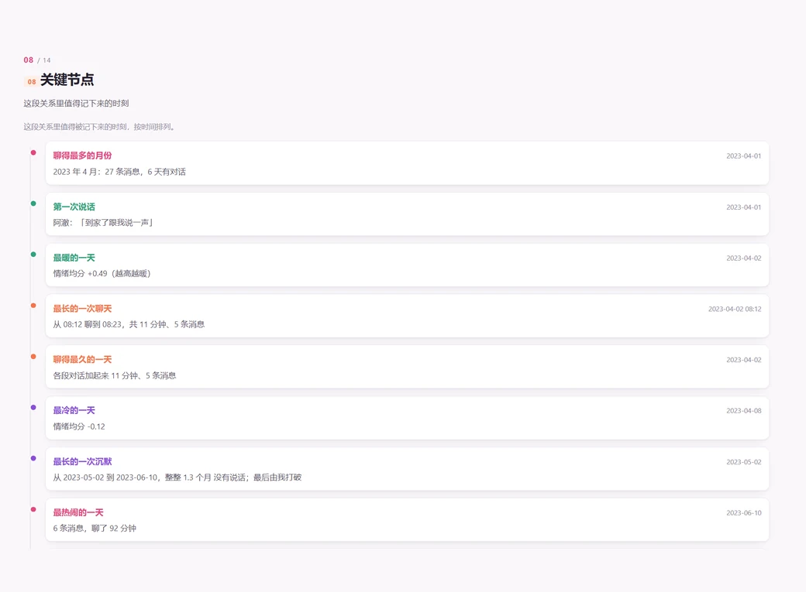

<div align="center">

# 🌼 loves-me-not

**Does TA love me, or not?**

Pulling the petals off a chat log, one message at a time.

Turns an exported chat log into a 0–100 emotional-investment score,
computed **entirely on your machine**, and renders a shareable **single-file HTML report**.

[](https://www.python.org/)
[](#-installation)
[](#-caveats)
[](#-tests)
[](LICENSE)

[中文](README.md) · **English**

[Features](#-features) · [Install](#-installation) · [Usage](#-usage) ·
[Scoring](#-scoring) · [Report](#-report) · [Caveats](#-caveats)

</div>

---

> **This is an entertainment and self-reflection tool, not a relationship judge.**
> It cannot know what the other person is thinking. It can only count who spoke first,
> who replied faster, and who ended the conversation.
> A low score does not mean they don't love you, and a high score does not mean you'll last.
>
> **Everything runs locally**: your chat log never leaves your device.
> No upload, no network calls, no cloud AI.

---

## 🎯 Features

**Input**: `.txt` `.log` `.csv` `.json` `.html` — tolerant parsing that auto-detects
speakers, timestamps and message bodies, plus encoding
(UTF-8 / GB18030 / Big5 / UTF-16).

**Five quantified metrics**: reply speed · messages per 5 minutes · late-night messages ·
who breaks the silence · who gets the last word. Every one prints its
**definition and data source** in the report.

**Eight descriptive dimensions**: reply interval · initiating conversations ·
average length · questions and follow-ups · pet names and emoji · who ends conversations ·
late-night activity · emotional trend. All computed as a **two-sided comparison**.

**Explainable scoring** + a **14-page visual report** (radar, trends, calendar heatmap,
word cloud, persona cards, timeline, quoted evidence, full weight breakdown).
Single-file HTML, zero external requests, opens with a double-click.

<p align="center">
  
</p>

---

## 📦 Installation

**No third-party dependencies.** Python 3.9+ is all you need.

```bash
git clone https://github.com/chang2005/loves_me_not.git
cd loves_me_not
python --version     # needs 3.9+
```

On Windows, use `py` if `python` is not available.

> "Your log never leaves your device" is the only reason this project deserves trust,
> so parsing, statistics, the sentiment lexicon and every chart are implemented from
> scratch. A test guard scans package imports and fails on any network dependency.

---

## 🚀 Usage

```bash
# 1. Verify the parse first (strongly recommended)
python -m loves_me_not inspect "path/to/chat.txt"

# 2. Generate the report
python -m loves_me_not analyze "path/to/chat.txt" \
    --me "my nickname" --peer "their nickname" \
    -o out/report.html --json out/result.json

# 3. Sharing it with someone? Redact first
python -m loves_me_not analyze "path/to/chat.txt" \
    --me "me" --peer "them" --redact -o out/report.html
```

`inspect` prints the detected **speakers, message count, time range and skipped lines**.
**If the input is wrong, the score is meaningless** — always check this step.

| Option | Description |
|---|---|
| `--me` / `--peer` | Nicknames for "me" and "them". When omitted they're inferred from speaking order and the report **warns you at the top to verify** — getting them backwards flips every conclusion |
| `-o, --output` | Report path, defaults to `out/report.html` |
| `--json` | Also emit machine-readable results (dimension scores, weights, contributions, trends, evidence) |
| `--redact` | Mask phone numbers, ID numbers, card numbers, emails, account IDs, addresses |
| `--format` | `auto` (default) / `text` / `csv` / `json` / `html` |

Exit codes: `0` success, `2` parse failure or bad arguments.
**On failure no report is written at all.**

### Supported inputs

Default `auto` looks at the **extension first, then content** — so a wrong suffix,
or no suffix at all, still works.

| Format | Key rules |
|---|---|
| `.txt` `.log` | Two-line style (timestamp + nickname, then body), paste style (nickname first), single-line `nickname: text`. Tolerates bracketed timestamps, `nickname(12345678)`, time-only `[21:33:02]` (rolls over midnight), and multi-line messages; system and recall notices are excluded |
| `.csv` | Fuzzy column matching; Chinese or English headers, or none |
| `.json` | Timestamps as Unix seconds/milliseconds, ISO 8601, `2023-04-01 21:33:02`, `2023年4月1日 21:33`; body taken from the first of `content`/`text`/`msg`/`body`; speaker from `isSend`, peer name from `remark` > `displayName` > `nickname` |
| `.html` | Data is embedded in the page, so it is **extracted first** (supports `window.X = [...]` and `<script type="application/json">`); brace-balanced scanning means braces inside message bodies never truncate it |

See [`samples/`](samples/README.en.md) for concrete examples.

> Two deliberate conservative choices:
>
> - **Records whose origin can't be determined are never forced onto one side.**
>   A sync record from your own second device (`isSend` is 0 but the sender ID is you)
>   is treated as a system message rather than counted as "they spoke" —
>   better to drop a few messages than to get the relationship backwards.
> - **When it can't tell, it errors out.** A web page with no chat data, JSON with no
>   message array, or a truncated file all raise a clear error instead of inventing a report.

---

## 🧮 Scoring

```text
total = 8-dimension model × 60% + 5 quantified metrics × 40%   (then shrunk toward 50 by sample size)
```

### The five quantified metrics (their behaviour only)

| Metric | Definition |
|---|---|
| **Reply speed** | Median gap between each of their replies and your previous message (gaps ≤24h only); 5 minutes ≈ 50 points |
| **Messages per 5 min** | Bucketed into 5-minute windows; mean count across **windows that contain messages**; peak also reported |
| **Late-night messages** | Count between 23:00–03:00 and its share of their total (20% ≈ 100 points) |
| **Breaking silence** | After a ≥24h gap, who speaks first; their breaks ÷ all breaks |
| **Getting the last word** | Who sent the final message of each conversation; 50% is most balanced |

Combined weights: **reply 30% / icebreak 25% / last word 20% / burst 15% / late night 10%**.

Two deliberate, counter-intuitive choices: **late night carries the lowest weight**
(3 a.m. messages signal emotional intensity, not investment), and
**icebreaking and last-word are symmetric** (50/50 is full marks; only one-sided
responsibility loses points) — "they always get the last word" does not mean "they love you more".

### Three non-negotiable rules

| Rule | Meaning |
|---|---|
| **No information ≠ 0 points** | When a dimension can't be computed it is **removed and the weights renormalized**; the report shows `N/A`. Never having used a pet name doesn't mean "they don't love you" — it means there's no information |
| **Small samples narrow the conclusion** | The score shrinks toward 50, confidence is downgraded, and a "⚠ insufficient sample" banner appears at the top. With only 5 messages it outputs "insufficient sample, no conclusion" and marks all 8 dimensions `N/A` |
| **Never fabricate** | If no messages can be parsed it exits with an error (code 2). Removed statistics render as "—" with a stated reason; the median of 2 replies is never presented as a conclusion |

### Tier verdicts

| Score | Tier | Score | Tier |
|---|---|---|---|
| 85–100 | still very much in love | 40–54 | already fading |
| 70–84 | warmth is there | 20–39 | basically over |
| 55–69 | a little flat | 0–19 | nearly time to let go |

With too few messages it outputs "insufficient sample, no conclusion" — any score would be noise.

---

## 🖼 Report

A single HTML file, **14 pages, flipped one page at a time** (CSS scroll snapping).
Wide screens get a fixed left sidebar; narrow screens collapse to a horizontal
top tab bar. Pages taller than the viewport simply grow — readability is never
sacrificed to force content into one screen.

| Action | Effect |
|---|---|
| Wheel / trackpad | Next or previous page (snaps, never stops mid-page) |
| `↓` `↑` / `PageDown` `PageUp` / Space | Page up and down |
| `Home` `End` | First page / last page |
| Click the sidebar | Jump straight to that page |

<p align="center">
  
  
</p>

The **five quantified metrics** state their definition, source, weight and contribution
so you can check the math yourself. The **calendar heatmap** shades each day by
the *sum of conversation durations that day* — not message count, and not the
first-to-last span (one message in the morning and one at night is not a whole day of talking).

<p align="center">
  
  
</p>

The **word cloud** sizes words by weighted frequency and colours them by who raised
the topic. **Key moments** line up chronologically: first contact, longest conversation,
longest silence, warmest and coldest day, and turning points in heat.

Other visualizations: chat footprint, 8-dimension radar, interaction trend lines,
"what kind of person TA is" (8 behavioural personas that describe only observable
behaviour and explicitly state they are not a character judgement), quoted evidence,
and the full weight breakdown.

**Closing**: beyond the tier-based comfort copy, one sentence **belonging to this
specific record** — the observation furthest from normal, phrased as praise when
signals are positive and gentle encouragement when they're weak. If nothing stands
out, nothing is written.

> [!NOTE]
> One hard constraint on entrance animations: **elements are visible by default**,
> and the hidden state is only enabled by script; the visible state must beat the
> hidden state and must not depend on a transition completing.
> ("Content permanently invisible because of its entrance animation" is a bug this
> project has hit three times; each is now covered by a test. See [`SKILL.en.md`](SKILL.en.md).)

---

## ⚠️ Caveats

Chat logs involve two people's privacy. Please make sure you have the participants'
consent or that the records are your own; process them locally only and never upload
them to a cloud drive, an online service or a public demo; and never use this to track,
monitor or control anyone. **This project does not read WeChat databases and does not
circumvent any platform's security mechanisms** — it only accepts files you exported
yourself and will never include any decryption capability.

`data/` and `out/` are already in `.gitignore`, so real logs are never committed.

**This report is generated from statistical patterns. It is for entertainment and
self-reflection only. It does not represent anyone's true feelings, and major
relationship decisions should be discussed with a professional.**

Three things to keep in mind:

- Sentiment analysis uses a **local lexicon**; sarcasm, dialect and memes will be misread.
  Every conclusion ships with the original excerpt — trust the words over the score.
- The report **only sees text**. Silence might mean coldness, or it might mean they were
  working until eleven and their phone died.
- Rather than agonizing over a number, just ask the question.

**Known limitations**: without a Chinese tokenizer the word cloud occasionally produces
meaningless fragments; group chats are reduced to "you + the most interactive person";
and images, voice messages and stickers can't be analysed — they only count as
"an interaction happened".

---

## 🧪 Tests

```bash
python -m unittest discover -s tests -v
```

**238 tests.** Some of them are **guardrails protecting the product's promises** —
don't delete these when changing core logic:

- Dimensions with no information must be removed, not scored as 0
- Insufficient samples must be downgraded, never given a strong conclusion;
  an undersampled metric's `score` must be `None`, not `0.0`
- A warmer record must score higher (the direction can't invert)
- The late-night window must be identical across metrics / insights / report (23:00–03:00)
- "How long we talked" must not be faked by the first-to-last span;
  "last word" and "icebreak" must be symmetric
- Personas may describe behaviour only, never deliver a character verdict
- Numbers in the personalized copy must match the real statistics
- The word cloud must not overlap; the gauge dasharray must be proportional to the score
- The report must be self-contained; `opacity: 0` must never appear in the base
  `[data-reveal]` rule
- The visible state must beat the hidden state; revealing must not walk every element each frame
- Sidebar clicks must be handled by script; the time label in structured HTML must be stripped
- Unrecognizable JSON / web pages must error out, never guess
- Inline scripts must pass `node --check`; the package must contain no network or
  subprocess dependencies

---

## 📂 Project layout

```text
loves-me-not/
├── SKILL.md / SKILL.en.md           # Skill definition (interface and boundaries)
├── README.md / README.en.md         # Chinese / English docs
├── docs/                            # screenshots used by the READMEs
├── loves_me_not/
│   ├── __main__.py          # CLI: analyze / inspect
│   ├── parser.py            # tolerant parsing: txt / csv → Message[], plus format detection
│   ├── structured.py        # JSON / embedded-web-data parsing (tolerant field names)
│   ├── lexicon.py           # sentiment lexicon + pet names + question words
│   ├── metrics.py           # the eight descriptive dimensions
│   ├── insights.py          # five quantified metrics + sessions + silences + calendar
│   ├── timeline.py          # footprint + key moments + topics + persona
│   ├── visuals.py           # heatmap / word cloud / persona / hour & month charts
│   ├── scoring.py           # explainable scoring, tiers, comfort copy
│   └── report.py            # single-file HTML / JSON output
├── samples/                 # synthetic sample data (not real logs)
├── demo/                    # finished reports generated from those samples
└── tests/                   # 238 unit tests
```

`demo/` holds finished reports generated from **synthetic data** — double-click to open:
[`report-cooling.html`](demo/report-cooling.html) (203 days, 58 points) ·
[`report-warm.html`](demo/report-warm.html) (29 days, 64 points) ·
[`report-too-short.html`](demo/report-too-short.html) (5 messages → **insufficient sample**)

---

## 📈 Star History

<a href="https://www.star-history.com/?repos=chang2005%2Floves_me_not.git&type=timeline&logscale=&legend=bottom-right">
  <picture>
    <source media="(prefers-color-scheme: dark)"
            srcset="https://api.star-history.com/svg?repos=chang2005/loves_me_not&type=Timeline&legend=bottom-right&theme=dark">
    
  </picture>
</a>

<details>
<summary><b>How to use this chart</b></summary>

Star History offers a **dynamic SVG endpoint** you can use directly as an image;
wrap it in a link so readers can click through to the interactive chart:

```markdown
[](https://www.star-history.com/?repos=chang2005%2Floves_me_not.git&type=timeline&logscale=&legend=bottom-right)
```

The image regenerates on every load, so **it updates itself as stars arrive** — no
README edits needed.

| Parameter | Effect |
|---|---|
| `repos=` | Repository as `user%2Frepo`; separate several with `,` to compare |
| `type=` | `timeline` (written `Timeline` for the endpoint); `date` also works |
| `logscale=` | Empty for linear; `1` for a log scale — nicer when stars go from single digits to thousands |
| `legend=` | Legend position, only meaningful when comparing several repos |

Alternatives: **iframe** (interactive, but GitHub blocks it — better for your own blog),
**multi-repo comparison** (`...?repos=owner/a,owner/b`), and **PNG export**
(download button at the top right of the chart).

Common snags: a blank chart (repo has no stars yet, or isn't public), a stale chart
(CDN cache — append `&v=2`), and a single flat line (too few stars — try `logscale=1`).

</details>

---

## 🤝 Contributing

Issues and PRs are welcome. When changing core logic, please:

1. **Don't** add any network calls or cloud AI — "fully local" is the only reason
   users dare to run this;
2. **Don't** output strong conclusions from insufficient samples, and never score
   "no information" as 0;
3. **Don't** put `opacity: 0` in the base `[data-reveal]` rule, and never let the
   visible state have lower specificity than the hidden state;
4. When changing scoring definitions, update the weight tables in both this file and
   `SKILL.en.md`;
5. Run `python -m unittest discover -s tests -v` and keep it green.

---

## 📜 License

MIT. Before you use it, be decent to the person on the other end of the chat log.

<div align="center">
<br>
<sub>🌼 she/he loves me, she/he loves me not…</sub>
</div>
