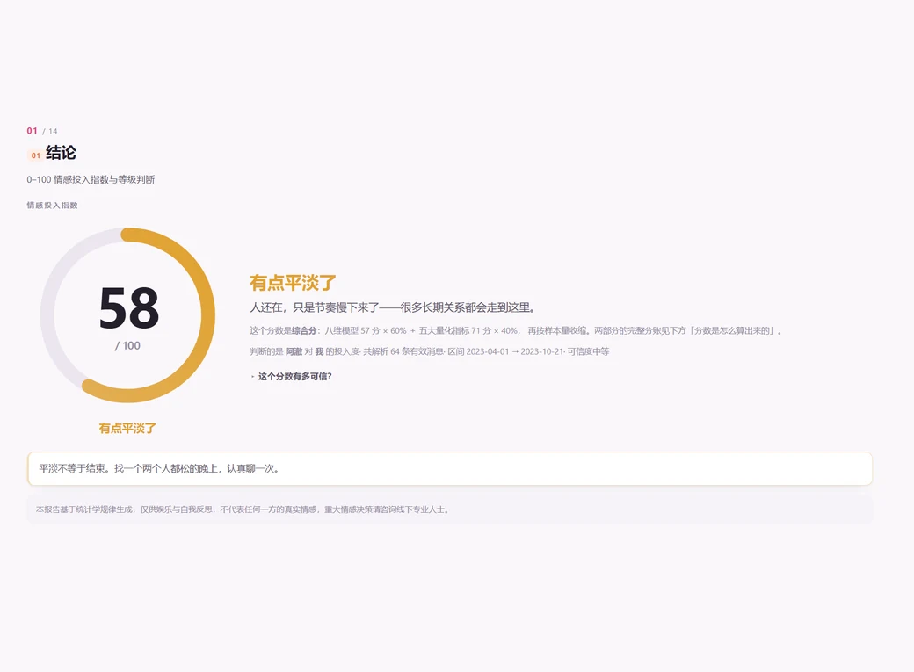
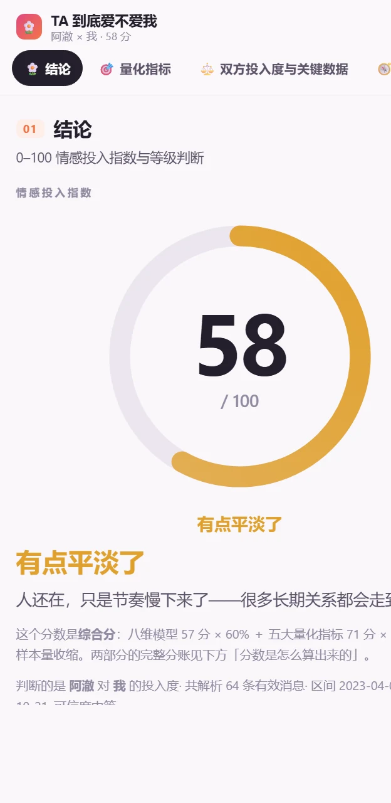
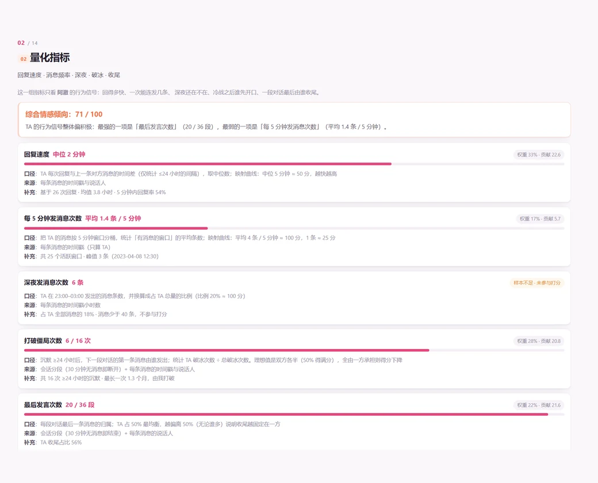
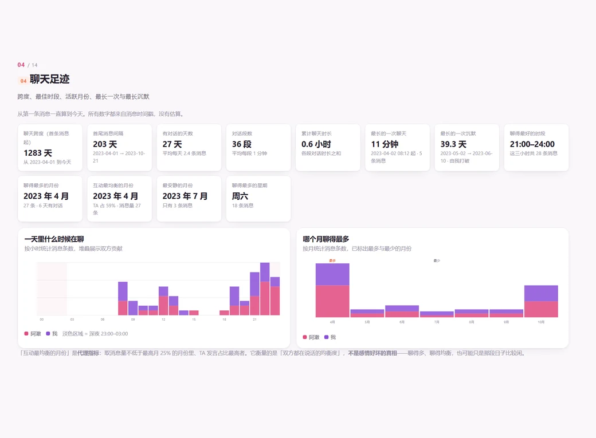
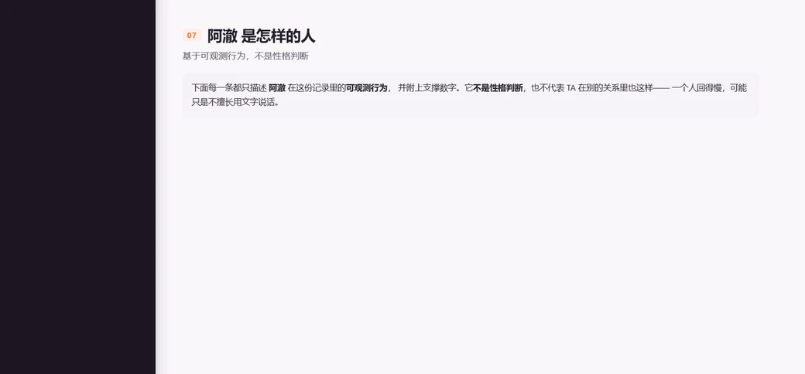
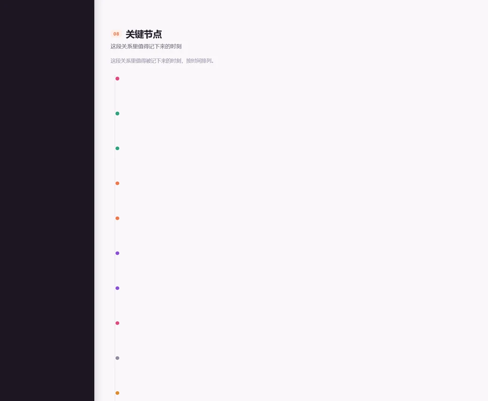
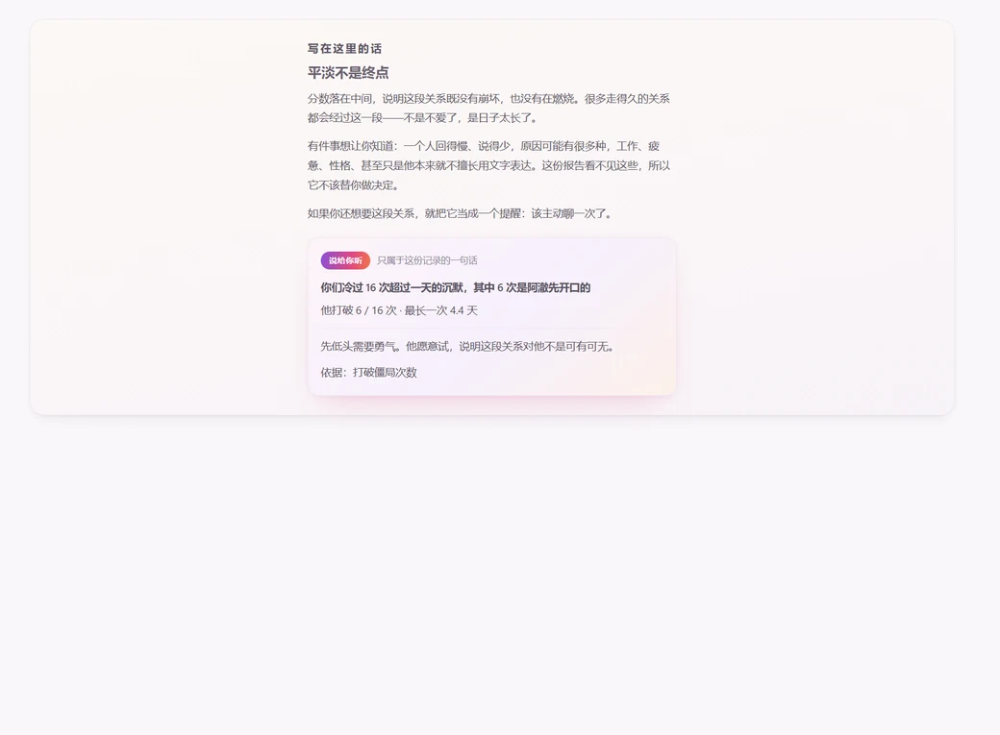

<div align="center">

# 🌼 loves-me-not

**TA 到底爱不爱我**

撕开聊天记录的花瓣，看看 TA 爱不爱你。

把导出的聊天记录在**本机**算成一个 0–100 的情感投入指数，
生成一份可以直接分享的**单文件 HTML 可视化报告**。

[](https://www.python.org/)
[](#-安装)
[](#-隐私与法律红线)
[](#-测试)
[](LICENSE)

[功能特性](#-功能特性) ·
[安装](#-安装) ·
[使用方法](#-使用方法) ·
[评分怎么算](#-评分怎么算) ·
[注意事项](#-注意事项) ·
[Star History](#-star-history)

</div>

---

> [!IMPORTANT]
> **这是「娱乐 + 自我反思」工具，不是关系裁判。**
> 它不知道对方在想什么，它只数得清谁先开口、谁回得快、谁在收尾。
> 分数低不等于他不爱你，分数高也不等于你们会一直在一起。
>
> **全流程在本机完成**：聊天记录不出你的设备，不上传、不联网、不调用任何云端 AI。

---

## 📸 先看效果

<p align="center">
  
</p>

左侧是固定导航（14 个章节），首屏直接给结论：环形仪表盘、等级大字、
可信度说明与综合算式，不用翻页就能看完。移动端自动折叠为顶部可横滑的标签栏：

<p align="center">
  
</p>

---

## 🎯 这个项目做什么

| | |
|---|---|
| ✅ **做** | 把导出的聊天记录解析成结构化数据；用统计学规律把相处模式画成看得见的图；给一个有口径、可复核的分数 |
| ❌ **不做** | 不读微信数据库、不绕过任何平台的安全机制、不调用云端模型、不替你判断一段关系该不该继续 |
| ✅ **给** | 每个结论都附**原始聊天片段**与**计算口径**，让你自己复核 |
| ❌ **不给** | 样本不足时不给强结论、不虚构内容、不编造「TA 的真实想法」 |

**一句话**：把「他到底怎么想的」这个无解的问题，
换成「我们的相处模式长什么样」这个能看清楚的问题。

---

## ✨ 功能特性

<table>
<tr><td width="50%" valign="top">

**🔍 容错解析**

支持 txt / csv / log，自动识别说话人、时间戳与消息内容。
多种时间戳格式、多行消息、系统消息、撤回提示、
`[图片]` 等媒体标记全部容错处理；UTF-8 / GB18030 / Big5 / UTF-16 自动探测编码。

**🎯 五个量化指标**

回复速度 · 每 5 分钟发消息次数 · 深夜发消息次数 ·
打破僵局次数 · 最后发言次数。
每一项都在报告里印出**计算口径与数据来源**。

**📊 八个描述性维度**

回复间隔、主动发起、平均字数、提问追问、
称呼与表情、谁在结束对话、深夜活跃、情绪走向。
全部做**双方对比**并计算不对称度。

**🧮 可解释打分**

权重全表暴露，贡献可逐条对账。
**没有信息 ≠ 0 分**——算不出来的维度会被剔除、权重重新归一化。

</td><td width="50%" valign="top">

**📅 日历热力图**

一整年的对话铺成一张图，每格一天，
**颜色越深代表那天聊得越久**（算的是各段对话时长之和，
不是消息条数、也不是首尾跨度）。

**💬 话题词云**

抽出现最多的话题关键词。字号 = 加权词频，
颜色 = 这个话题主要由谁说起。
本地 n-gram 实现，无需 jieba。

**🪞「TA 是怎样的人」**

8 类**行为画像**卡片（深夜型／秒回型／话多型／主动型／
忽冷忽热型…），每张附强度条与支撑数字。
只描述可观测行为，**明确声明不是性格判断**。

**💌 个性化收尾文案**

按等级选的通用安慰之外，还会**从这段记录的真实数据里
长出一句只属于它的话**。挑不出独特观察时就不写——
宁可少一句，也不硬编。

</td></tr>
</table>

**还有**：互动趋势四张折线图、关键节点时间线、24 小时活跃度分布、
月度消息量、双方投入度对比、原话证据链、完整权重分账。
报告是**单文件 HTML**，内联 CSS + 内联 SVG，**零外部请求**，双击即开。

---

## 📦 安装

**不需要安装任何第三方依赖。** 只要 Python 3.9 或更高版本。

```bash
git clone https://github.com/chang2005/loves_me_not.git
cd loves_me_not

# 确认 Python 版本
python --version     # 需要 3.9+
```

Windows 上如果 `python` 不可用，把下面所有命令里的 `python` 换成 `py`。

<details>
<summary>为什么是零依赖？</summary>

「聊天记录不出本机」是这个项目唯一值得被信任的理由。
每多一个第三方依赖，就多一个偷偷联网、多一个供应链风险、
多一个「我到底把数据交给了谁」的疑问。

所以解析、统计、情感词典、图表渲染**全部自己实现**，
只用标准库。测试里有一条护栏专门扫描包内 import，
一旦引入网络或子进程依赖就直接失败。
</details>

---

## 🚀 使用方法

### 1. 核对解析结果（强烈建议）

```bash
python -m loves_me_not inspect "path/to/chat.txt"
```

它会打印识别到的**说话人、消息条数、时间范围、跳过行数**，
以及前几条消息。**输入错了，分数就没有意义**，所以先看这一步。

### 2. 生成报告

```bash
python -m loves_me_not analyze "path/to/chat.txt" \
    --me "我的昵称" \
    --peer "TA的昵称" \
    -o out/report.html \
    --json out/result.json
```

跑完会在控制台打印分数、等级、可信度与所有数据说明，
并把报告写到 `-o` 指定的路径（默认 `out/report.html`）。

### 3. 想把报告发给别人看？先打码

```bash
python -m loves_me_not analyze "path/to/chat.txt" --me "我" --peer "TA" \
    --redact -o out/report.html
```

### 参数一览

| 参数 | 说明 |
|---|---|
| `--me` | 「我」的昵称。**不指定时会按说话人出现顺序推断，并在报告顶部警告你核对**——搞反了整份结论会颠倒 |
| `--peer` | 「TA」的昵称。记录里有 3 个以上说话人（群聊）时建议指定 |
| `-o, --output` | 报告输出路径，默认 `out/report.html` |
| `--json` | 额外输出机器可读的完整结果（维度分、权重、贡献、分段趋势、证据） |
| `--redact` | 对报告中的手机号、身份证、卡号、邮箱、账号、地址做打码 |
| `--format` | `auto`（默认）/ `text` / `csv`，强制指定输入格式 |

**退出码**：`0` 成功；`2` 表示解析失败或参数有误。
**失败时不会生成任何报告**，更不会编一份出来。

### 支持的输入格式

<details open>
<summary><b>两行式（最常见的导出格式）</b></summary>

```text
2023-04-01 21:33:02 阿澈
到家了跟我说一声

2023-04-01 21:35:11 我
到啦
```
</details>

<details>
<summary><b>粘贴式（昵称在前面）</b></summary>

PC 端直接复制出来的 `昵称  日期 时间` 格式也直接支持：

```text
阿澈  2023/11/05 22:14:03
今天加班到好晚

我  2023/11/05 22:15:10
辛苦啦 吃饭了吗
```
</details>

<details>
<summary><b>表格（CSV）</b></summary>

列名顺序可以不同，会按列名模糊匹配；也支持中文表头与无表头：

```csv
localId,Time,Sender,Content
1,2023-04-01 21:33:02,阿澈,到家了跟我说一声
2,2023-04-01 21:35:11,我,到啦
```

```csv
时间,发送者,内容
2023-04-01 21:33:02,阿澈,到家了跟我说一声
```
</details>

<details>
<summary><b>其他被容错处理的形态</b></summary>

- 方括号时间戳：`[2023-04-01 21:33:02] 阿澈`
- 带账号后缀：`2023-04-01 21:33:02 阿澈(12345678)`
- 只有时间（同一天导出）：`[21:33:02] 阿澈`，自动推断日期并跨天进位
- 单行冒号式：`阿澈: 到家了跟我说一声`
- 多行消息：昵称行之后的连续行自动并入同一条
- 系统消息：`撤回了一条消息`、`加入了群聊` 等自动识别并排除出统计
</details>

---

## 🧮 评分怎么算

总分由**两个视角综合**而成：

```text
总分 = 八维模型 × 60% + 五个量化指标 × 40%     （再按样本量收缩）
```

### 五个量化指标（只看 TA 的行为信号）

| 指标 | 计算口径 | 数据来源 |
|---|---|---|
| **回复速度** | TA 每次回复与上一条对方消息的时间差（仅统计 ≤24 小时的间隔），取**中位数**；5 分钟 ≈ 50 分 | 消息时间戳 + 说话人 |
| **每 5 分钟发消息次数** | 按 5 分钟窗口分桶，取**有消息的窗口**的平均条数；另给峰值 | 消息时间戳 |
| **深夜发消息次数** | 23:00–03:00 的条数，及占 TA 总量的比例（20% ≈ 100 分） | 时间戳小时数 |
| **打破僵局次数** | 沉默 ≥24 小时后，下一段对话由谁先开口；TA 破冰 ÷ 总破冰 | 会话分段 + 时间戳 |
| **最后发言次数** | 每段对话最后一条消息的归属；TA 占 50% 最均衡 | 会话分段 + 说话人 |

综合权重：**回复 30% / 破冰 25% / 收尾 20% / 爆发 15% / 深夜 10%**。

> [!NOTE]
> 两个反直觉但刻意的设计：
> 1. **深夜权重最低**——凌晨消息多是「情感浓度」信号，不是「投入」信号（也可能只是作息晚）。
> 2. **破冰与收尾是对称的**——双方各半满分，全由一方承担扣分。
>    「TA 每次都收尾」不等于「TA 更爱你」。

### 八个描述性维度

回复间隔与响应速度 · 主动发起对话次数 · 平均字数与投入度 · 提问与追问比例 ·
称呼与表情使用 · 谁在结束对话 · 深夜及特定时段活跃度 · 情绪倾向随时间变化。

每个维度先算子指标 → 各自映射到 0–100 → 加权得维度分 → 再加权得总分。
权重全部印在报告的「分数是怎么算出来的」一节里。

### 三条不可让步的规则

<table>
<tr><td>

**① 没有信息 ≠ 0 分**

维度算不出来时**剔除该维度并重新归一化权重**，
结果里记录 `skipped`，报告里显示 `N/A`。

典型例子：全程没出现过任何亲昵称呼。
这不代表「TA 不爱你」，只是没有信息。

</td><td>

**② 样本不足要收窄结论**

分数向 50 收缩（shrinkage），可信度降级，
报告顶部直接打出「⚠ 样本不足」横幅，并**拒绝给强结论**。

只有 5 条消息时会直接输出「样本不足，无法给结论」，
8 个维度全部标 `N/A`。

</td><td>

**③ 绝不虚构**

解析不出消息直接报错退出，退出码 2。
空文件、二进制文件、加密数据库都不会产出报告。

被剔除的统计量在数据卡片上显示为「—」并注明原因，
不会把「2 次回复的中位数」当成结论展示。

</td></tr>
</table>

### 等级结论

| 分数 | 等级 | 说明 |
|---|---|---|
| 85–100 | 还是很爱你 | 主动、秒回、话题不断 |
| 70–84 | 热度在线 | 整体稳定，偶有降温 |
| 55–69 | 有点平淡了 | 还在，但节奏放慢了 |
| 40–54 | 已经在变淡 | 多项指标偏向单方面 |
| 20–39 | 基本没戏 | 长期单方面投入，回应稀薄 |
| 0–19 | 几乎可以放手了 | 数据上看这段关系已经停摆 |
| — | 样本不足，无法给结论 | 消息太少，任何分数都是噪声 |

---

## 🖼 报告里有什么

单文件 HTML，**左侧固定导航**（14 个章节），滚动时自动高亮当前章节。
移动端折叠为顶部可横滑的标签栏。导航是普通锚点链接，
**禁用 JavaScript 也照样能用**。

### 五个量化指标

每一项都写明口径、来源、权重与贡献，可以自己复核：

<p align="center">
  
</p>

### 聊天足迹

跨度、聊得最好的时段、活跃月份、最长一次聊天、最长沉默，
以及 24 小时活跃度与月度分布：

<p align="center">
  
</p>

### 日历热力图

仿贡献图式样：每格一天，**颜色深浅 = 当天各段对话时长之和**。

> 刻意用「各段对话时长之和」而不是「当天首尾跨度」——
> 早上说一句、晚上说一句，不该被算成聊了一整天。
> 这里衡量的是**真正交谈的时间密度**。

<p align="center">
  
</p>

### 话题词云

字号 = 加权词频，颜色 = 这个话题主要由谁说起：

<p align="center">
  
</p>

### 「TA 是一个怎样的人」

<p align="center">
  
</p>

### 结尾的个性化文案

按等级选的通用安慰之外，还有一句**只属于这份记录**的话：

<p align="center">
  
</p>

候选观察有八类：深夜还在回你、一次聊得格外久、某个月是峰值、
回得很快／回得很慢、冷战之后是他先开口、某个节日他特意发了消息、
总是他先找你／总是你先找他、有过特别暖的一天。

三条规则：**先算再写**（文案里的数字必须与统计对得上）、
**挑最独特的**（按偏离常规程度取最高分，所以不同记录得到不同的话）、
**看人下菜**（整体偏积极时落点是夸赞，偏弱时是温和鼓励，都不指责）。

---

## 🎨 视觉与动效

**配色**走柔和渐变系（紫 → 品红 → 珊瑚 → 暖橙），低饱和、大留白。
彩色只用于强调、图表与状态，**正文保持中性深灰**——否则整页会花，反而不好读。

颜色只有一份定义（`loves_me_not/visuals.py` 的 `PALETTE`），
报告 CSS 与所有图表都从它取值，有测试断言两者是同一个对象。

**动效**：滚入淡入上浮、卡片按 60–70ms 错峰浮现、总分从 0 滚到目标值、
进度条从 0 长出、折线自左向右描边画出、热力图格子像涟漪铺开、
词云由大到小浮现、卡片悬停轻微浮起。全部尊重 `prefers-reduced-motion`。

> [!IMPORTANT]
> **动效安全**：元素默认是**可见**的，只有脚本加上 `html.anim-ready` 之后，
> CSS 才把它们藏起来等待入场。所以脚本没跑、跑挂或被浏览器拦掉时，
> 页面就是一份「没有动画的正常文档」，而不是一片空白。
> 主脚本另有 1.5 秒兜底，会把任何仍未显示的内容强制显示出来。

---

## 🧪 测试

```bash
python -m unittest discover -s tests -v
```

**180 项测试**，其中一批是**守住产品承诺的护栏**，改动核心逻辑时不要删：

- 无信息的维度必须被剔除，而不是当成 0 分（含「表情线索不可得」的情形）
- 样本不足必须降级为「样本不足」，不得输出强结论
- 采样不足的量化指标 `score` 必须是 `None`，不能是 `0.0`
- 更暖的记录必须得到更高的分（打分方向不能反）
- 深夜时段在 metrics / insights / 报告里必须是同一个口径（23:00–03:00）
- 「聊了多久」不能用首尾跨度冒充（散落一天 ≠ 聊了一整天）
- 「谁收尾」「谁破冰」必须是对称的：50% 满分，两端更低
- 行为画像只能说行为，不能出现人格判决措辞
- 个性化文案里的数字必须与真实统计对得上
- 词云排版不得重叠；仪表盘 dasharray 长度必须与分数成比例
- 报告必须自包含；`[data-reveal]` 的基础规则里**不许**出现 `opacity: 0`
- 内联脚本必须通过 `node --check` 语法校验
- 包内不许出现任何网络或子进程依赖（守住「全本地」）

---

## 📂 项目结构

```text
loves-me-not/
├── SKILL.md                 # Skill 定义（给 Agent 读的接口说明与使用边界）
├── README.md
├── docs/                    # README 用的截图
├── loves_me_not/
│   ├── __main__.py          # CLI：analyze / inspect
│   ├── parser.py            # 容错解析：txt / csv → Message[]
│   ├── lexicon.py           # 情感词典 + 亲昵称呼 + 疑问词（可审计、可替换）
│   ├── metrics.py           # 八个描述性维度的计算
│   ├── insights.py          # 五个量化指标 + 会话分段 + 沉默 + 日历聚合
│   ├── timeline.py          # 聊天足迹 + 关键节点 + 话题关键词 + 行为画像
│   ├── visuals.py           # 热力图 / 词云 / 画像 / 时段与月度图（内联 SVG）
│   ├── scoring.py           # 可解释打分、等级结论、安慰文案
│   └── report.py            # 单文件 HTML / JSON 生成
├── samples/                 # 合成示例数据（非真实记录）
├── demo/                    # 由示例数据生成的成品报告
└── tests/                   # 180 项单元测试
```

### 想看看它长什么样？

`demo/` 里有用**合成数据**生成的成品报告，双击就能打开：

| 文件 | 说明 |
|---|---|
| [`demo/report-cooling.html`](demo/report-cooling.html) | 从热到冷的 203 天 → 58 分「有点平淡了」 |
| [`demo/report-warm.html`](demo/report-warm.html) | 互相都在投入的 29 天 → 64 分 |
| [`demo/report-too-short.html`](demo/report-too-short.html) | 只有 5 条消息 → **样本不足，无法给结论** |

---

## 📈 Star History

如果这个项目让你有点想点个 Star，那它就有继续维护下去的理由 🌼

<a href="https://www.star-history.com/?repos=chang2005%2Floves_me_not.git&type=timeline&logscale=&legend=bottom-right">
  <picture>
    <source media="(prefers-color-scheme: dark)"
            srcset="https://api.star-history.com/svg?repos=chang2005/loves_me_not&type=Timeline&legend=bottom-right&theme=dark">
    
  </picture>
</a>

<p align="center">
  <a href="https://www.star-history.com/?repos=chang2005%2Floves_me_not.git&type=timeline&logscale=&legend=bottom-right">
    
  </a>
</p>

<details>
<summary><b>怎么在 GitHub 上使用这张 Star History 图表</b></summary>

### 1. 图表从哪来

[Star History](https://www.star-history.com/) 是一个免费服务：
它读取 GitHub 的公开 API，把一个仓库的 Star 增长画成时间线，
**不需要授权、不需要安装任何东西**，你只要在 URL 里写上仓库名。

这个仓库对应的链接是：

```text
https://www.star-history.com/?repos=chang2005%2Floves_me_not.git&type=timeline&logscale=&legend=bottom-right
```

参数含义：

| 参数 | 作用 |
|---|---|
| `repos=` | 仓库，格式 `用户名%2F仓库名`（`%2F` 就是 `/` 的 URL 编码）；多个仓库用 `,` 分隔可对比 |
| `type=timeline` | 图表类型。还支持 `date`（按日期累计） |
| `logscale=` | 留空为线性刻度；填 `1` 或 `true` 用对数刻度——**Star 从个位数涨到几千时**对数刻度更好看 |
| `legend=bottom-right` | 图例位置，多仓库对比时才有意义 |

### 2. 放进 README（本项目用的方式）

Star History 提供了**动态 SVG 接口**，直接当图片嵌进 Markdown 就行：

```markdown
[](https://www.star-history.com/?repos=chang2005%2Floves_me_not.git&type=timeline&logscale=&legend=bottom-right)
```

要点：

- 用**链接包图片**，读者点图就能跳到完整的交互式图表；
- `api.star-history.com/svg` 每次打开都会重新生成，
  **Star 涨了图会自己更新**，不用手动改 README；
- 想跟随深色模式，就用上面读写的那套 `<picture>` +
  `prefers-color-scheme` 写法，给两种主题各一张图；
- `type=Timeline` 是接口的参数写法（注意首字母大写），
  与网站 URL 里的 `type=timeline` 等价。

### 3. 其他嵌入方式

**① 直接用 iframe**（可交互，但在 GitHub 里会被安全策略拦住，
更适合放在自己的博客或项目主页）：

```html
<iframe src="https://www.star-history.com/?repos=chang2005%2Floves_me_not.git&type=timeline&legend=bottom-right"
        width="720" height="420" frameborder="0" scrolling="no"></iframe>
```

**② 多个仓库对比**：把 `repos` 用逗号连起来。

```text
https://api.star-history.com/svg?repos=owner/a,owner/b&type=Timeline
```

**③ 导出 PNG**：打开网站后点图表右上角的下载按钮，
得到静态图片，适合放进 PPT 或文章配图。

### 4. 常见坑

| 现象 | 原因 |
|---|---|
| 图是空白的 | 仓库还没被 Star，或不是公开仓库 |
| 用户名写错 | `repos` 里的 `%2F` 不能改成 `/` 以外的字符；GitHub 用户名区分大小写不敏感，但仓库名区分 |
| 图很久不更新 | 浏览器/CDN 缓存。加个查询参数强制刷新，例如 `&v=2` |
| 只有一条直线 | Star 太少或时间跨度太短；试试 `logscale=1` |

</details>

---

## ⚠️ 注意事项

### 隐私与法律红线

**🚨 本项目不读取微信数据库，不绕过任何平台的安全机制。**
它只接受**你自己用导出工具导出的文本 / CSV 文件**。
相关平台已明确打击通过代码注入或提示词注入获取聊天记录的行为——
本项目**不内置**、也**永不会内置**任何解密数据库的功能。

**🚨 聊天记录涉及双方隐私。** 用量分析别人的聊天记录本身有伦理灰度，请确认：

- 你已获得对话参与者的授权，或这些记录是你自己的；
- 你只在本地处理，不把原始记录上传到任何网盘 / 在线服务 / 公开 demo；
- 不要用它去跟踪、监视、控制任何人。

**🚨 全本地是默认行为，不是选项。** 代码里没有任何网络调用，
`data/`、`out/` 已在 `.gitignore` 中，你的真实记录不会被提交进版本库。

### 结果解读

- **本报告基于统计学规律生成，仅供娱乐与自我反思，不代表任何一方的真实情感，
  重大情感决策请咨询线下专业人士。**
- 情感分析用的是**本地词典**，反讽、方言、网络梗会误判。
  所以每条结论都附原始片段，请以原话为准。
- 报告**只看得见文字**。沉默可能是冷淡，也可能是他那天加班到十一点、
  手机没电，或者他本来就不太会说话。

### 使用建议

| 建议 | 原因 |
|---|---|
| **先跑 `inspect`** | 输入错了，分数就毫无意义 |
| **始终显式指定 `--me` / `--peer`** | 自动推断可能搞反，结论会整体颠倒 |
| **关注可信度与样本量** | 样本不足时报告会明确标注，不要当真 |
| **把分数当起点，不是终点** | 它指出的是「哪些地方值得聊一聊」 |
| **别反复测** | 与其对着一个数字反复揣测，不如直接问一句 |

### 已知局限

- 中文 n-gram 没有分词器，词云偶尔会切出无意义片段（已有冗余抑制，但非完美）。
- 「互动最均衡的月份」是**代理指标**，衡量双方说话的均衡度，
  **不是感情好坏的真相**——聊得多也可能只是那段日子比较闲。
- 群聊会降级为「你 + 互动最多的那一位」，其他人的话完全不参与统计。
- 图片、语音、表情包的内容无法分析，只作为「发生过一次互动」计入条数。

---

## 🤝 贡献

欢迎提 Issue 和 PR。改动核心逻辑时请：

1. **不要**加入任何网络调用或云端 AI——「全本地」是用户敢用的唯一理由；
2. **不要**在样本不足时输出强结论，也不要把「无信息」当成 0 分；
3. **不要**在 `[data-reveal]` 的基础规则里写 `opacity: 0`；
4. 改打分口径时，同步更新本文件与 `SKILL.md` 里的权重表；
5. 跑一遍 `python -m unittest discover -s tests -v`，保持全绿。

---

## 📜 许可

MIT。用它之前，请先对得起聊天记录另一端的那个人。

<div align="center">
<br>
<sub>🌼 he loves me, he loves me not…</sub>
</div>
